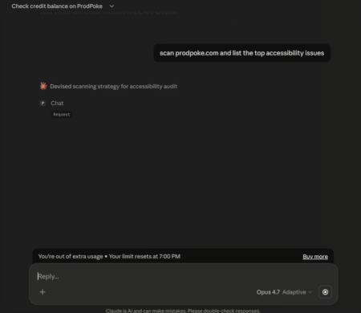

# ProdPoke MCP Server

> **A QA tester inside your AI.** Chat with ProdPoke from Claude, Cursor, or any MCP
> client. It launches real Playwright browsers, finds real bugs, and remembers what
> you talked about across turns.

[](LICENSE)
[](https://modelcontextprotocol.io)
[](https://prodpoke.com/mcp)

**Hosted**, not installed. Just paste a config into your MCP client and go.

[Landing page](https://prodpoke.com/mcp) · [Get an API key](https://prodpoke.com/app/settings/keys) · [Pricing](https://prodpoke.com/pricing) · [ProdPoke](https://prodpoke.com)

<!-- TODO: replace with real demo once recorded
<p align="center">
  
</p>
-->

---

## What it does

ProdPoke is a remote, stateful MCP server that runs real-browser QA for any website. You
describe what you want in plain English; ProdPoke spins up a headless Playwright session,
navigates the site, and streams back structured findings — accessibility, SEO,
performance, user-flow bugs, visual regressions, broken CTAs, and more.

Unlike local tools, everything runs on ProdPoke infrastructure. No Chromium to install,
no browser containers to manage, no cleanup.

## Available tools

| Tool | Description | Parameters |
|------|-------------|------------|
| `chat` | Talk to ProdPoke like a QA tester — scan a URL, test a flow, investigate findings, set session preferences. Stateful via `session_id`. | `message` (required), `session_id` (optional) |
| `get_credit_balance` | Check your remaining scan credits. | — |

### Example `chat` response

```json
{
  "session_id": "a1b2c3d4-...",
  "response": "Found 3 issues on https://example.com...",
  "findings": [
    {
      "severity": "high",
      "category": "accessibility",
      "title": "Missing alt text on 4 images",
      "description": "Images in the hero section lack alt attributes..."
    },
    {
      "severity": "medium",
      "category": "seo",
      "title": "Missing meta description",
      "description": "The page has no meta description tag..."
    }
  ],
  "session_context": {
    "url_being_tested": "https://example.com",
    "message_count": 2,
    "has_findings": true
  }
}
```

---

## Setup

### 1. Get your API key

1. [Sign up](https://prodpoke.com/auth/login) for a ProdPoke account — the free tier
   includes 500 credits, enough for a first scan.
2. Go to [Settings → API Keys](https://prodpoke.com/app/settings/keys).
3. Click **Create new key** and copy it immediately (it's shown once; you can't recover
   it later, but you can revoke and re-mint).

Keys look like `pp_` followed by 64 hex characters.

### 2. Paste the config into your MCP client

<details open>
<summary><strong>Claude Desktop / Cursor / Claude Code</strong> (streamable HTTP — recommended)</summary>

```json
{
  "mcpServers": {
    "prodpoke": {
      "type": "streamable-http",
      "url": "https://prodpoke.com/v1/mcp",
      "headers": {
        "Authorization": "Bearer pp_YOUR_KEY_HERE"
      }
    }
  }
}
```

Config file locations:
- **Claude Desktop (macOS)**: `~/Library/Application Support/Claude/claude_desktop_config.json`
- **Claude Desktop (Windows)**: `%APPDATA%\Claude\claude_desktop_config.json`
- **Claude Code**: `.mcp.json` in your project root
- **Cursor**: Settings → MCP Servers

Fully restart the client after editing.

</details>

<details>
<summary><strong>Clients that only support stdio</strong> (via <code>mcp-remote</code> bridge)</summary>

```json
{
  "mcpServers": {
    "prodpoke": {
      "command": "npx",
      "args": [
        "mcp-remote",
        "https://prodpoke.com/v1/mcp",
        "--header",
        "Authorization: Bearer ${PRODPOKE_API_KEY}"
      ],
      "env": {
        "PRODPOKE_API_KEY": "pp_YOUR_KEY_HERE"
      }
    }
  }
}
```

Uses [`mcp-remote`](https://github.com/geelen/mcp-remote) to proxy stdio ↔ streamable HTTP.

</details>

### 3. Start chatting

Try any of these:

- *"Scan https://mysite.com and tell me what's broken"*
- *"Run an accessibility audit on https://example.com"*
- *"Test the signup flow on https://app.example.com — fill the form and check the confirmation page"*
- *"What bugs have you found on mysite.com?"*
- *"Scan https://competitor.com and compare their SEO headers to ours"*
- *"Check my ProdPoke credit balance"*

---

## Multi-step sessions

The `chat` tool is stateful. Each response includes a `session_id`; pass it back to continue
the conversation with full context:

1. `chat("Scan https://mysite.com")` — starts a session, runs the scan, returns `session_id` + findings.
2. `chat("Dig deeper into the accessibility issues", session_id="...")` — builds on the prior scan.
3. `chat("Now test the checkout flow", session_id="...")` — runs a targeted test, knows about the earlier findings.
4. `chat("What should I fix first?", session_id="...")` — answers from the accumulated session context.

Sessions persist across MCP client restarts for the lifetime of the key.

---

## How it works

```
Your MCP client  ──Authorization: Bearer pp_...──▶  https://prodpoke.com/v1/mcp
                                                       │
                                                       ▼
                                           Orchestrator classifies intent
                                                       │
                                                       ▼
                                           Playwright worker on ProdPoke
                                            infrastructure runs the scan
                                                       │
                                                       ▼
                                          Findings streamed back as a
                                               structured `chat` response
```

Nothing is installed on your machine. Scans run on our servers. You pay per scan in
credits (see below).

---

## Pricing

| Plan | Credits | Price |
|---|---|---|
| **Free tier** | 500 credits | $0 |
| **Watch** | 10,000 / month | $15 / month |
| **Watch Pro** | 50,000 / month | $49 / month |
| **Top-up packs** | 1,000 – 50,000 | From $3 |

A standard scan costs roughly 10 credits. Deeper workflows — full user-flow tests,
competitor comparisons — run 400–500 credits. [See full pricing →](https://prodpoke.com/pricing)

The error message when you're out of credits is explicit: `"Insufficient credits. You
need N but have M."`, so your AI client can surface it clearly.

---

## Troubleshooting

- **`401 Missing Authorization header`** — your client didn't send the `Authorization`
  header. Double-check the config (the key goes in `headers`, not `env`, for streamable HTTP).
- **`401 Invalid or revoked API key`** — the key was revoked or typed incorrectly. Re-mint at
  [/app/settings/keys](https://prodpoke.com/app/settings/keys).
- **The tool responds but never runs a scan** — ask it to scan a specific URL. ProdPoke
  needs a URL to launch a browser; it won't guess.
- **Scan hangs for >2 minutes** — the MCP call times out at 120 seconds per step. Long
  flows should be split into multiple `chat` turns using `session_id`.

---

## Links

- [ProdPoke](https://prodpoke.com)
- [MCP landing page](https://prodpoke.com/mcp)
- [API Keys dashboard](https://prodpoke.com/app/settings/keys)
- [Pricing](https://prodpoke.com/pricing)
- [MCP Protocol specification](https://modelcontextprotocol.io)

## License

MIT — see [LICENSE](LICENSE).
